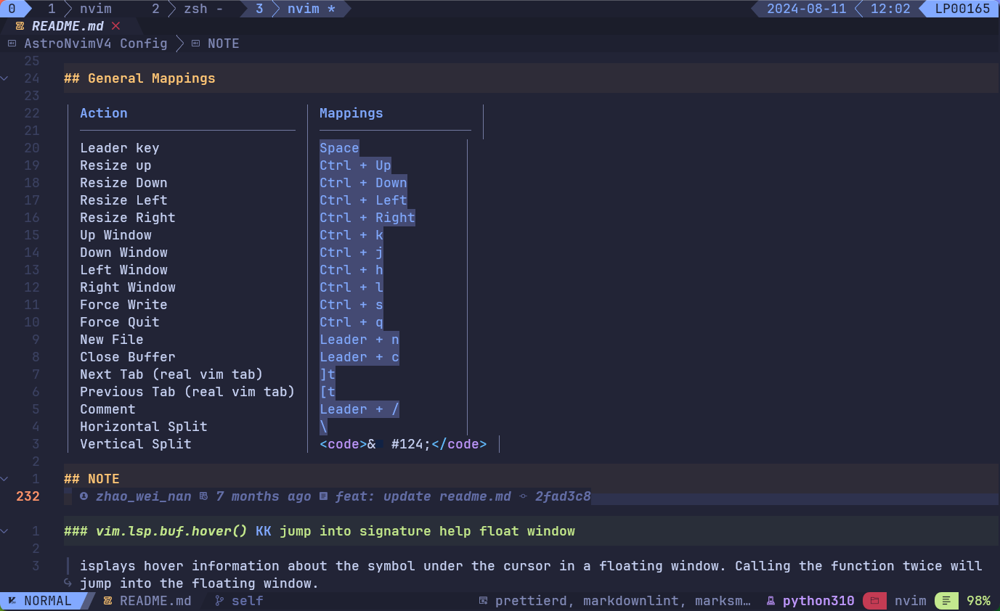
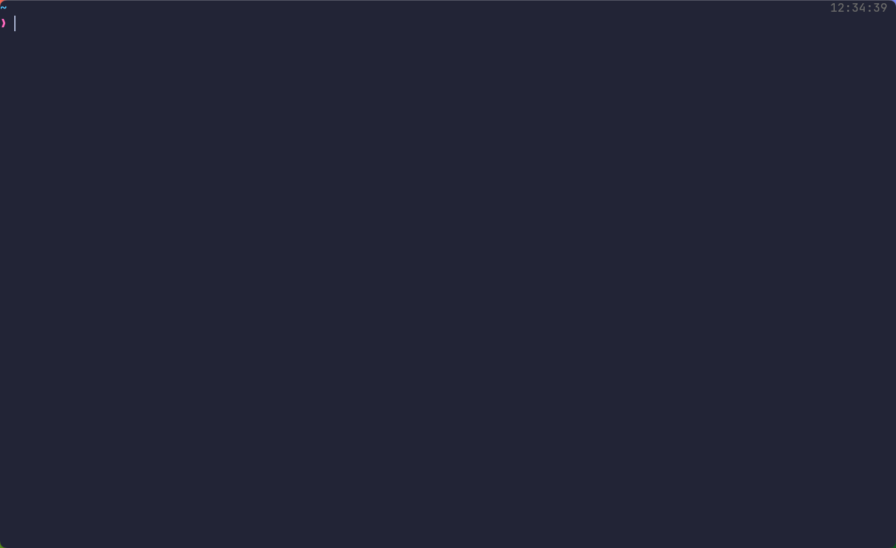
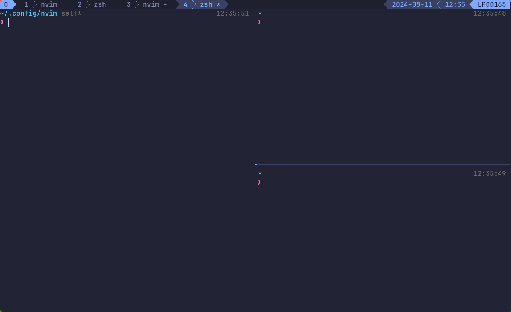
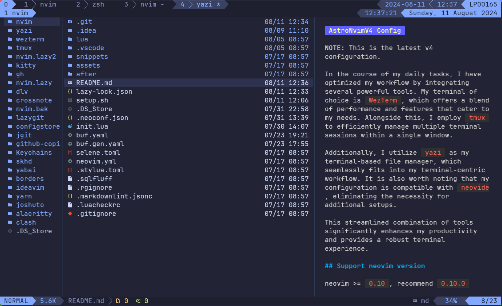

# AstroNvimV4 Config

**NOTE:** This is the latest v4 configuration.

In the course of my daily tasks, I have optimized my workflow by integrating several powerful tools. My terminal of choice is `WezTerm`, which offers a blend of performance and features that cater to my needs. Alongside this, I employ `tmux` to efficiently manage multiple terminal sessions within a single window.

Additionally, I utilize `yazi` as my terminal-based file manager, which seamlessly fits into my terminal-centric workflow. It is also worth noting that my configuration is compatible with `neovide`, eliminating the necessity for additional setups.

This streamlined combination of tools significantly enhances my productivity and provides a robust terminal experience.

## Support neovim version

neovim >= `0.10`, recommend `0.10`

## Features

now,this config supports development in `TypeScript`,`Python`,`Go`,`Rust` and `markdown`.

- **_`Typescript`_**: `vtsls`
- **_`Python`_**: `basedpyright`
- **_`Go`_**: `gopher.nvim` _-- support go zero framework_
- **_`Markdown`_**: `iamcco/markdown-preview.nvim`,
- **_`Rust`_**: `mrcjkb/rustaceanvim`

## workflow screenshot

`wezterm` + `tmux` + `astronvim`



`wezterm`



`tmux`



`yazi`


## other components config

`wezterm`: [https://github.com/chaozwn/wezterm]('https://github.com/chaozwn/wezterm')

`tmux`: [https://github.com/chaozwn/tmux]("https://github.com/chaozwn/tmux")

`yazi`: [https://github.com/chaozwn/yazi]("https://github.com/chaozwn/yazi")

## 🛠️ Installation

### The system should supports commands

`npm`,`rustc`,`go`,`tmux` -- if you want to use `tmux-awesome-manager`

### Recommend install

```shell
yay fzf
yay luarocks
yay lazygit
yay ripgrep
npm install -g tree-sitter-cli
yay gdu
yay bottom
yay protobuf
yay clazy
yay cmake-format
```
#### Note
for linux, a 'trash' command is needed, use package manager to install package "trash-cli"

### Make a backup of your current nvim and shared folder

```shell
mv ~/.config/nvim ~/.config/nvim.bak
mv ~/.local/share/nvim ~/.local/share/nvim.bak
mv ~/.local/state/nvim ~/.local/state/nvim.bak
mv ~/.cache/nvim ~/.cache/nvim.bak
```

### Create a new user repository from this template

Press the "Use this template" button above to create a new repository to store your user configuration.

You can also just clone this repository directly if you do not want to track your user configuration in GitHub.

### Clone the repository

```shell
git clone https://github.com/chaozwn/astronvim_with_coc_or_mason ~/.config/nvim
```

### Start Neovim

```shell
nvim
```

## Tips

### NVcheatsheet
`<F2>`

 

### Use Lazygit

`<leader>tl`


### Install unimatrix

`<Leader>tm`

```shell
pip install git+https://github.com/will8211/unimatrix.git
```


### Install TTE

`<Leader>te`

```shell
pip install terminaltexteffects
```


### Neovim requirements

```
npm install -g neovim
pip install pynvim
```

### Markdown Image Paste

```shell
pip install pillow
```

### Input Auto Switch

```shell
brew tap daipeihust/tap
brew install im-select
im-select
```

run `im-select` & copy result to `im-select.lua`

```lua
return {
  "chaozwn/im-select.nvim",
  lazy = false,
  opts = {
    default_main_select = "com.sogou.inputmethod.sogou.pinyin", -- update your input method
    set_previous_events = { "InsertEnter", "FocusLost" },
  },
}
```

### Support styled-components

```shell
npm i -g @styled/typescript-styled-plugin typescript-styled-plugin
```

### Support for neovide

```
brew install neovide
neovide .
```

### Support Lazydocker

tigger command: `<leader>td`

```shell
brew install lazydocker
```

## General Mappings

| Action                      | Mappings            | Mode |
| --------------------------- | ------------------- |------|
| Leader key                  | `Space`               |   n  |
| Resize up                   | `Ctrl + Up`           |  n  |
| Resize Down                 | `Ctrl + Down`         |  n  |
| Resize Left                 | `Ctrl + Left`         |  n  |
| Resize Right                | `Ctrl + Right`        |  n  |
| Up Window                   | `Ctrl + k`            |  n  |
| Down Window                 | `Ctrl + j`             |  n  |
| Left Window                 | `Ctrl + h`          |  n  |
| Right Window                | `Ctrl + l`          |  n  |
| Force Write                 | `Ctrl + s`          |  n  |
| Force Quit                  | `Ctrl + q`          |  n  |
| New File                    | `Leader + n`        |  n  |
| Close Buffer                | `Leader + c`        |  n  |
| Next Tab (real vim tab)     | `]t`                |  n  |
| Previous Tab (real vim tab) | `[t`                |  n  |
| Comment                     | `Control + /`        |  n  |
| Horizontal Split            | `\`                 |  n  |
| Vertical Split              | <code>&#124;</code> |  n  |
| Open task menu              | `<Leader>c`          |  n  |

Copilot Mappings

| Action                      | Mappings            | Mode |
|-----------------------------|---------------------|------|
| 


## NOTE

### _vim.lsp.buf.hover()_ `KK` jump into signature help float window

> Displays hover information about the symbol under the cursor in a floating window. Calling the function twice will jump into the floating window.

## Project workspace setup
We use`<Leader>c` as menu,try to open a project and see what can be exec in current workspace.
To use neovim to develop c/c++ cmake base project,we use 'cmake-tools' to run cmake tasks.
The same time,we use 'overseer' to run other project,like c/c++ project base on makefile,Rust proejct ,Python project,Frontend project,etc

